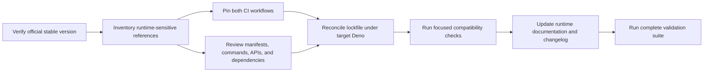

# Design Document: Deno Upgrade

## Overview

This design upgrades `hclang` from the observed local Deno 2.6.0 runtime and
floating CI `2.x` selectors to exact Deno 2.9.5. The
[official Deno release list](https://github.com/denoland/deno/releases/) marked
v2.9.5 as latest on 2026-08-09; implementation must recheck that page before
edits. The repository will pin the confirmed patch version in both workflows,
use frozen lockfile installation in CI, reconcile only compatibility-driven
configuration/source differences, and validate every workspace surface.

Research findings that shape the design:

- `deno --version` reports Deno 2.6.0, V8 14.2.231.17-rusty, and TypeScript
  5.9.2 locally.
- `.github/workflows/deno.js.yml` implicitly selects Deno 2.x;
  `.github/workflows/deploy.yml` explicitly selects `v2.x`. Neither workflow is
  patch-reproducible.
- The root workspace contains `cli`, `lib`, `maml`, and `web`, with four package
  `deno.json` files and one root `deno.lock`.
- Deno 2.9 includes TypeScript 6, formatter changes, workspace/task changes, and
  dependency-install changes; these make type-check, format, task, and lockfile
  validation mandatory. See the
  [Deno 2.9 release overview](https://deno.com/blog/v2.9).
- Official CI guidance states that `denoland/setup-deno@v2` accepts exact
  versions and that `deno ci` enforces the committed lockfile. See
  [Run Deno in GitHub Actions](https://docs.deno.com/examples/deno_github_actions_tutorial/).
- Compatibility hotspots are Fresh 1.7.3 remote imports, `--unstable-kv`
  commands in `web`, `Deno.Command`/`Deno.execPath` in
  `lib/execute/script-spec.ts`, compile behavior in `cli`, and generated
  `deno.lock` metadata.

Content from upstream sources is summarized and rephrased for licensing
compliance.

## Architecture

The upgrade is a gated configuration migration rather than a runtime feature:



Each gate produces reviewable evidence. Downstream work must not start with an
unknown target or incomplete inventory. The implementation favors exact pins and
minimal compatibility edits over broad dependency modernization.

### Design Decisions

1. **Exact CI patch pin:** Both workflows use `deno-version: v2.9.5` (or the
   newly reverified exact stable value). This removes drift between
   implementation and later CI runs.
2. **Frozen CI install:** Replace CI `deno install` with `deno ci`; deployment
   receives the same frozen-install gate before build.
3. **Single lockfile authority:** Keep the root `deno.lock`; do not introduce
   package lockfiles unless target Deno requires them.
4. **Minimal dependency movement:** Retain existing Fresh, standard-library,
   JSR, and esm.sh versions unless target-runtime validation proves
   incompatibility.
5. **No runtime version field invention:** Deno manifests do not currently
   declare an engine version, so workflow pins and contributor documentation
   remain the repository’s runtime contract.

## Components and Interfaces

### Runtime Target Gate

Inputs are local runtime output, the official latest-release marker, and
verification date. Output is one exact `Target_Runtime` consumed by every other
task. A changed upstream stable version updates the design/task constants
consistently before repository implementation begins.

### Workflow Configuration

| File                            | Current state                                     | Planned state                                                                         |
| ------------------------------- | ------------------------------------------------- | ------------------------------------------------------------------------------------- |
| `.github/workflows/deno.js.yml` | `setup-deno@v2` with implicit 2.x; `deno install` | Exact target `deno-version`; `deno ci`; existing build/test/publish behavior retained |
| `.github/workflows/deploy.yml`  | Explicit `deno-version: v2.x`; no frozen install  | Exact target `deno-version`; `deno ci` before build; deploy action retained           |

Both workflow edits form one implementation unit because they establish one CI
runtime contract and must not race in DAG execution.

### Workspace Compatibility Surface

- `deno.json`: preserve workspace membership and task semantics; review
  formatter/linter/compiler behavior under Deno 2.9.5.
- `cli/deno.json`: verify `deno compile`, permissions, CLI tests, BitScheme, and
  documentation tasks.
- `lib/deno.json`: verify strict type-checking and JSR package exports.
- `maml/deno.json`: verify the package’s currently separate test task because
  root `test:all` omits MAML.
- `web/deno.json` and `web/dev.ts`: verify Fresh 1.7.3, remote imports, and
  `--unstable-kv`; change only options rejected or behaviorally incompatible
  with the target.
- `lib/execute/script-spec.ts`: verify subprocess argument construction and
  `Deno.Command` behavior.
- `deno.lock`: regenerate with target Deno only after configuration/dependency
  decisions settle; commit changes only when generated deterministically.

### Documentation Surface

`README.md`, `CLAUDE.md`, `doc/spec/2-deno-hooks/README.md`, and `CHANGELOG.md`
are reviewed for stale runtime guidance. Only conflicting guidance is changed.
The changelog records the observed 2.6.0 baseline, selected target, and
validation result.

## Data Models

These records are planning/evidence structures represented in the implementation
summary; they do not require a new application database or runtime schema.

```typescript
interface UpgradeInventoryEntry {
  path: string;
  category:
    | "workflow"
    | "manifest"
    | "lockfile"
    | "command"
    | "api"
    | "dependency"
    | "documentation";
  currentState: string;
  disposition: "change" | "retain" | "conditional";
  rationale: string;
  validationCommand: string;
}

interface ValidationRecord {
  command: string;
  denoVersion: string;
  result: "passed" | "failed";
  notes?: string;
}
```

The inventory is complete when every discovered reference has one disposition
and validation command. Validation evidence is complete when every command below
has a passing record under the exact target runtime.

## Error Handling

- **Upstream target changed:** Update the exact target in planning artifacts
  before implementation; do not mix versions across workflows or evidence.
- **Inventory cannot be recorded:** Stop before implementation because untracked
  runtime assumptions make the upgrade non-reviewable.
- **Frozen install fails:** Determine whether manifests and lockfile disagree.
  Regenerate with the exact target only when dependency resolution metadata must
  change; do not use `--no-lock` or silently relax frozen mode.
- **Lockfile regeneration fails:** Preserve the existing lockfile, record the
  failure, and continue only changes independently validated without a new
  resolution graph. Final validation cannot pass until frozen install succeeds.
- **Formatter produces changes:** Inspect target-runtime formatting differences.
  Apply deterministic formatting in a dedicated compatibility edit, then
  validate with `deno fmt --check`.
- **Type, lint, build, or test failure:** Attribute the failure to runtime,
  dependency, or pre-existing behavior; make the smallest upgrade-scoped fix and
  add a regression test when behavior changes.
- **Web compatibility failure:** Review Fresh 1.7.3 and unstable KV flags before
  upgrading dependencies. Dependency upgrades are a last resort and require
  inventory rationale.
- **Generated build artifacts change:** Keep generated binaries out of the
  upgrade diff unless the repository intentionally tracks and requires the
  target-built artifact.

Rollback is file-scoped: restore prior workflow selectors/install commands,
source/configuration edits, documentation, and the previous lockfile together. A
partial rollback that leaves CI and lockfile versions inconsistent is not valid.

## Testing Strategy

Property-based testing is not appropriate. The upgrade consists of declarative
workflow/configuration edits, generated lockfile reconciliation, and external
runtime/toolchain integration. There is no meaningful universal input domain for
a “for all inputs” property. Deterministic static checks, existing unit tests,
build tests, and CI integration checks provide stronger evidence.

### Validation Sequence

Run every command with the exact target runtime and from the repository root
unless noted:

1. `deno --version` — prove the executing runtime equals the confirmed target.
2. `deno ci` — prove manifests and the committed lockfile are reproducible in
   frozen mode.
3. `deno fmt --check` — detect target formatter drift without modifying files.
4. `deno lint` — validate configured recommended, Fresh, and explicit lint
   rules.
5. `deno check cli/hc.ts lib/mod.ts maml/tag.ts web/main.ts` — type-check each
   workspace entry surface, including TypeScript-version changes.
6. `deno task build` — compile the CLI under the target runtime.
7. `deno task test:all` — run the existing aggregate CLI, library, and web
   suites.
8. `deno task test:maml` — cover the workspace member omitted by `test:all`.
9. `deno task test:bs` — validate the BitScheme executable documentation path.
10. `deno task test:doc` — validate HC documentation examples.

If a source compatibility fix is required, add or update an example-based
unit/regression test adjacent to the affected component and run that focused
test before the complete sequence. The final pass must use non-mutating quality
commands so success does not conceal uncommitted formatter or lint fixes.

### CI Acceptance

The Deno CI workflow must prove frozen installation, CLI build, and the complete
configured test aggregate under the exact target. The deploy workflow must prove
frozen installation and web build before invoking the existing deployment
action. Hosted deployment itself is not executed as part of local validation.

## Requirements Traceability

| Requirements | Design coverage                                                  |
| ------------ | ---------------------------------------------------------------- |
| 1.1–1.5      | Runtime Target Gate and exact-version decision                   |
| 2.1–2.5      | Workspace Compatibility Surface and UpgradeInventoryEntry        |
| 3.1–3.6      | Workflow Configuration, lockfile authority, compatibility review |
| 4.1–4.6      | Workspace checks, focused remediation, regression tests          |
| 5.1–5.6      | Ordered Validation Sequence and failure handling                 |
| 6.1–6.4      | Documentation Surface and implementation summary records         |
