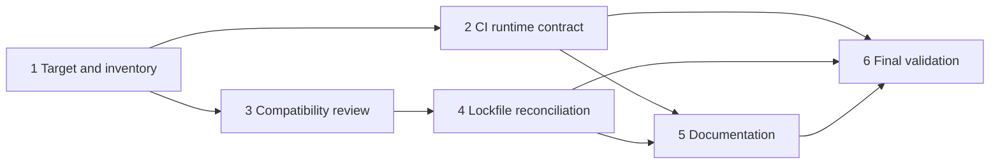

# Implementation Plan: Deno Upgrade

## Overview

Upgrade the repository from local Deno 2.6.0 and floating CI 2.x selectors to
the exact stable target currently identified as Deno 2.9.5. Tasks form a
dependency DAG so independent file sets can be implemented in parallel without
write conflicts. Reconfirm the official stable release before starting; if the
value changed, substitute the newly confirmed exact version consistently.

## Task Dependency Graph



```json
{
  "waves": [
    { "wave": 1, "tasks": ["1.1"] },
    { "wave": 2, "tasks": ["1.2"] },
    { "wave": 3, "tasks": ["2.1", "3.1"] },
    { "wave": 4, "tasks": ["3.2", "4.1"] },
    { "wave": 5, "tasks": ["5.1"] },
    { "wave": 6, "tasks": ["5.2"] },
    { "wave": 7, "tasks": ["6.1"] },
    { "wave": 8, "tasks": ["6.2"] },
    { "wave": 9, "tasks": ["6.3"] }
  ]
}
```

Tasks 2 and 3 may run concurrently after Task 1. Tasks that touch the same file
are intentionally grouped.

## Tasks

- [x] 1. Finalize the target-runtime inventory
  - [x] 1.1 Update the implementation summary with the reverified stable Deno
        release
    - Recheck the official Deno releases page and record the exact version,
      source URL, and date in `spec/4-deno-upgrade.md`.
    - Preserve the observed local baseline of Deno 2.6.0 and both current
      floating CI locations.
    - If upstream no longer marks 2.9.5 latest, replace every planned target
      reference consistently before downstream edits.
    - **Depends on:** none
    - _Requirements: 1.1, 1.2, 1.3, 1.4, 1.5_
  - [x] 1.2 Complete the runtime-sensitive reference dispositions
    - Record change/retain/conditional dispositions for both workflows, four
      workspace manifests, root lockfile, task commands, Fresh/JSR/esm.sh
      imports, unstable KV flags, `Deno.Command` usage, and runtime
      documentation.
    - Halt downstream edits if an inventory entry cannot be recorded.
    - **Depends on:** 1.1
    - _Requirements: 2.1, 2.2, 2.3, 2.4, 2.5_

- [x] 2. Establish the exact CI runtime contract
  - [x] 2.1 Pin and freeze both GitHub Actions workflows
    - In `.github/workflows/deno.js.yml`, configure `denoland/setup-deno@v2`
      with the exact target version and replace `deno install` with `deno ci`.
    - In `.github/workflows/deploy.yml`, replace `v2.x` with the same exact
      target and add `deno ci` before the build.
    - Retain existing triggers, permissions, build/test, publish, release, and
      deploy behavior.
    - **Depends on:** 1.2
    - _Requirements: 3.1, 3.2, 6.4_

- [x] 3. Reconcile target-runtime compatibility
  - [x] 3.1 Review manifests, commands, APIs, and dependencies under the target
        runtime
    - Run focused format, lint, type-check, CLI compile, and package test checks
      to identify concrete Deno 2.9 incompatibilities.
    - Review `deno.json`, `cli/deno.json`, `lib/deno.json`, `maml/deno.json`,
      `web/deno.json`, `web/dev.ts`, and `lib/execute/script-spec.ts`.
    - Retain compatible imports, options, unstable flags, and APIs with
      inventory rationale; modify only rejected or behaviorally incompatible
      references.
    - Record an explicit target-runtime rationale for any source edit not
      triggered by an observed failure.
    - **Depends on:** 1.2
    - _Requirements: 2.2, 2.4, 2.5, 3.3, 3.6, 4.1, 4.2, 4.4, 4.5_
  - [x] 3.2 Add focused regression tests for compatibility source changes
    - For each source behavior modified by Task 3.1, add or update an adjacent
      Deno test that reproduces the target-runtime failure and verifies the
      preserved behavior.
    - Skip this task when Task 3.1 requires no source behavior changes.
    - **Depends on:** 3.1
    - _Requirements: 4.5, 4.6_

- [x] 4. Reconcile generated dependency metadata
  - [x] 4.1 Regenerate and review the root lockfile under the exact target
        runtime
    - Run target-runtime dependency installation only after manifest and
      dependency decisions are final.
    - Update `deno.lock` only when target Deno produces a deterministic metadata
      change; do not introduce workspace lockfiles.
    - If regeneration fails, preserve the existing lockfile, record the failure,
      and allow only independently validated changes to continue.
    - Verify a frozen `deno ci` succeeds before considering the upgrade
      complete.
    - **Depends on:** 3.1
    - _Requirements: 3.4, 3.5, 3.6, 5.1_

- [x] 5. Document the supported runtime and completed compatibility work
  - [x] 5.1 Update contributor-facing runtime guidance
    - Update only guidance in `README.md`, `CLAUDE.md`, or
      `doc/spec/2-deno-hooks/README.md` that conflicts with the confirmed
      target/support decision.
    - Keep installation instructions platform-neutral and align local
      expectations with exact CI validation.
    - **Depends on:** 2.1, 4.1
    - _Requirements: 6.1, 6.4_
  - [x] 5.2 Add the Deno upgrade changelog and finalize inventory evidence
    - Add a concise `CHANGELOG.md` entry naming local Deno 2.6.0, the confirmed
      exact target, compatibility changes, and validation outcome.
    - Update `spec/4-deno-upgrade.md` with final changed-file dispositions and
      successful validation evidence.
    - **Depends on:** 5.1
    - _Requirements: 6.2, 6.3, 6.4_

- [x] 6. Final checkpoint - validate the complete upgrade under the exact target
      runtime
  - [x] 6.1 Execute the deterministic quality and compatibility suite
    - Run `deno --version`, `deno ci`, `deno fmt --check`, `deno lint`, and
      `deno check cli/hc.ts lib/mod.ts maml/tag.ts web/main.ts`.
    - Retain failure output until each corrected command passes.
    - **Depends on:** 2.1, 4.1, 5.2
    - _Requirements: 4.1, 5.1, 5.2, 5.3, 5.5_
  - [x] 6.2 Execute build and complete automated test coverage
    - Run `deno task build`, `deno task test:all`, `deno task test:maml`,
      `deno task test:bs`, and `deno task test:doc`.
    - Correct upgrade-caused failures and rerun focused checks before the final
      full pass.
    - **Depends on:** 6.1
    - _Requirements: 4.2, 4.3, 4.4, 4.6, 5.4, 5.5_
  - [x] 6.3 Confirm a clean final validation pass
    - Rerun the complete Validation Suite once after all corrections and record
      the exact Deno version and passing results in `spec/4-deno-upgrade.md`.
    - Ensure formatting/lint checks are non-mutating and no unexplained lockfile
      or generated build artifact remains.
    - Ensure all tests pass, ask the user if questions arise.
    - **Depends on:** 6.2
    - _Requirements: 5.6, 6.3, 6.4_

## Notes

- Tasks marked with `*` are optional and apply only when compatibility
  remediation changes source behavior.
- No property-test tasks are included because the design has no Correctness
  Properties section; this upgrade is configuration and external-runtime
  integration work.
- Dependency metadata and documentation tasks join only after their
  implementation prerequisites, making the checklist safe for DAG scheduling.
- This plan does not authorize implementation during spec creation.
