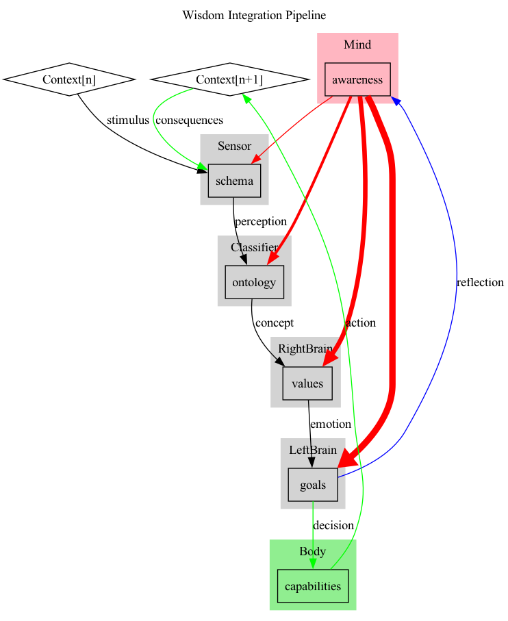

# The Wisdom Improvement Protocol

## How Self-Differentiation Unites AIs, Humans, and Societies in Better Decision-Making

## Overview

The **Wisdom Improvement Protocol** offers a novel framework for understanding
how AIs, humans, and societies can enhance decision-making through an integrated
process of perception, evaluation, action, and reflection. By drawing on Karl
Friston’s **active inference model**, this protocol emphasizes
**self-differentiation**—the ability to stay true to core values while adapting
to changing environments. This approach not only minimizes prediction errors but
also aligns actions with deeper principles, fostering continuous growth and
wisdom.

## How It Works: A Step-by-Step Walkthrough

### 1. Initial Context

- **Context[n]:** Every decision-making process begins within a specific
  environment that presents stimuli, serving as the starting point for action.
  This context, in active inference terms, represents the sensory data that the
  system or individual must interpret to reduce uncertainty.

### 2. Perception and Interpretation

- **Schema (Sensor):** The stimuli are organized and categorized through a
  mental framework, or schema, which structures the information to make it
  actionable. This parallels the predictive coding process in active inference,
  where the system anticipates sensory inputs based on prior knowledge.
- **Ontology (Classifier):** The categorized information is then interpreted to
  form concepts, refining the system’s understanding of the environment. This
  step ensures that new data aligns with existing models of the world.

### 3. Emotional and Value-Based Processing

- **Values (RightBrain):** The concepts are evaluated through an emotional or
  ethical lens, guided by core values and beliefs. This step adds depth to the
  decision-making process, ensuring that actions are not just about minimizing
  prediction errors but also about aligning with what matters most.

### 4. Goal Formation and Decision-Making

- **Goals (LeftBrain):** Based on the evaluation of values, specific goals are
  set, directing actions in a way that is consistent with both immediate needs
  and long-term principles. In active inference, this is akin to selecting
  actions that fulfill predictions while aligning with overarching objectives.

### 5. Action and Response

- **Capabilities (Body):** The decisions are translated into concrete actions,
  which impact the environment and generate feedback. These actions embody the
  system’s efforts to resolve prediction errors by actively engaging with the
  world, a core principle of active inference.

### 6. Reflection and Adaptation

- **Awareness (Mind):** After actions are taken, outcomes are reflected upon,
  leading to the reassessment of schemas, ontologies, values, and goals. This
  reflection phase is critical for adapting and updating internal models based
  on new experiences, ensuring that the system continues to evolve. The red
  lines in the diagram emphasize that this is the stage where modifications
  occur , driving continuous learning and adaptation -- though more easily at
  the higher levels.

### 7. New Context

- **Context[n+1]:** The environment is updated as a result of the actions,
  providing new stimuli and restarting the cycle. This ongoing process of action
  and reflection fosters the iterative learning essential to developing wisdom.

## How These Features Implement Self-Differentiation

### Embodied Wisdom

The protocol shows that wisdom is more than just an intellectual exercise—it
integrates mind, emotion, and action. Self-differentiation ensures that
decisions—whether made by AIs, individuals, or societies—are grounded in core
principles while effectively engaging with the external world. Through actions,
wisdom becomes embodied in tangible outcomes, linking theory with practice.

### Iterative Learning

Wisdom evolves through a continuous cycle of experience, reflection, and
adaptation. In this process, self-differentiation provides stability by keeping
core elements like schemas, ontologies, values, and goals consistent during
inference while allowing for their modification during reflection. This balance
between consistency and adaptability is key to ongoing learning and improvement.

### Contextual Response

Effective decision-making requires an understanding of and response to specific
contexts. In the active inference framework, this means minimizing prediction
errors in a way that is adaptive to the environment. Self-differentiation
ensures that decisions remain aligned with core values even as they adapt to new
challenges, making them both principled and responsive.

## Conclusion

The **Wisdom Improvement Protocol** integrates Karl Friston’s active inference
model with the concept of self-differentiation, offering a structured approach
to decision-making that balances consistency with adaptability. By following
this protocol, AIs, humans, and societies can make decisions that are not only
effective in minimizing prediction errors but also deeply aligned with core
values, fostering continuous growth and wisdom across diverse domains. This
model provides a powerful framework for enhancing decision-making in technology,
personal development, and societal governance.
