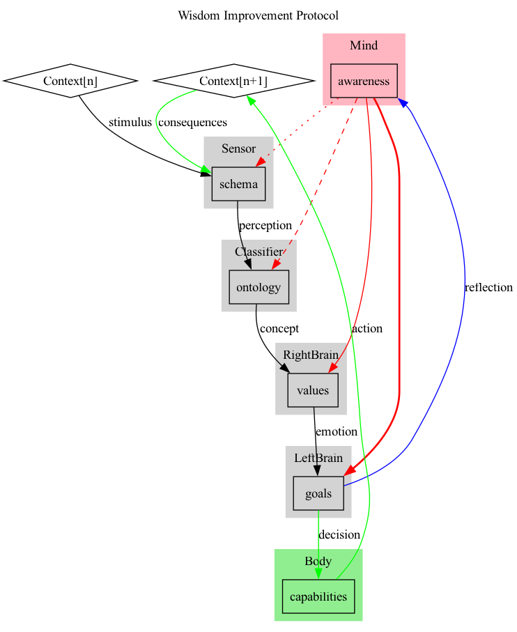

# Wisdom Integration Pipeline

## Overview

The **Wisdom Integration Pipeline** is a model that illustrates how wisdom is developed through a dynamic, embodied, and contextual process. This model captures the interaction between our mind, emotions, and actions, showing how each experience contributes to a continuous cycle of learning and adaptation.

## Key Concepts

1. **Embodied Wisdom:**
   - Wisdom isn’t just about thinking—it's about doing. This model shows that wisdom integrates our thoughts, emotions, and physical actions. It recognizes that our decisions are influenced by our emotions (RightBrain), guided by our goals (LeftBrain), and ultimately expressed through our actions (Body).

2. **Iterative Learning:**
   - Wisdom is developed over time through a continuous loop of experience, reflection, and adaptation. Each action we take impacts our environment, which in turn provides new stimuli for us to process and learn from in the next cycle.

3. **Contextual Response:**
   - Wisdom is not a one-size-fits-all solution. It’s about responding appropriately to the specific challenges of each situation. This model begins with an understanding of the current context and adapts as the context changes, ensuring that decisions are always relevant to the circumstances.

## How It Works

### 1. Initial Context

- **Context[n]:** The process begins with a specific environment or situation that presents stimuli.

### 2. Perception and Interpretation

- **Schema (Sensor):** We process these stimuli through a mental framework, organizing and categorizing the information.
- **Ontology (Classifier):** This organized information is interpreted, forming concepts that fit within our understanding of the world.

### 3. Emotional and Value-Based Processing

- **Values (RightBrain):** The concepts are then evaluated emotionally, based on our values and beliefs.

### 4. Goal Formation and Decision-Making

- **Goals (LeftBrain):** Based on this emotional evaluation, we set goals and make decisions on how to act.

### 5. Action and Response

- **Capabilities (Body):** These decisions are translated into actions, which create a new context or environment.

### 6. Reflection and Adaptation

- **Awareness (Mind):** We reflect on the outcomes of our actions, reassessing and refining our perceptions, values, and decisions. This reflection helps us learn and adapt, feeding into the next cycle of the process. Thicker lines represent how it is easier to modify our Goals and Actions than our Perception and Values.

### 7. New Context

- **Context[n+1]:** The new environment or situation that arises from our actions provides fresh stimuli, starting the cycle anew.

## Conclusion

The **Wisdom Integration Pipeline** model offers a holistic view of how wisdom is cultivated through the integration of mind, emotion, and body in a continuous, context-sensitive process. It emphasizes the importance of reflection and adaptation, showing that wisdom is not static but evolves with experience.

By understanding and applying this model, we can make better, more informed decisions that are deeply rooted in the realities of each unique situation we face.
